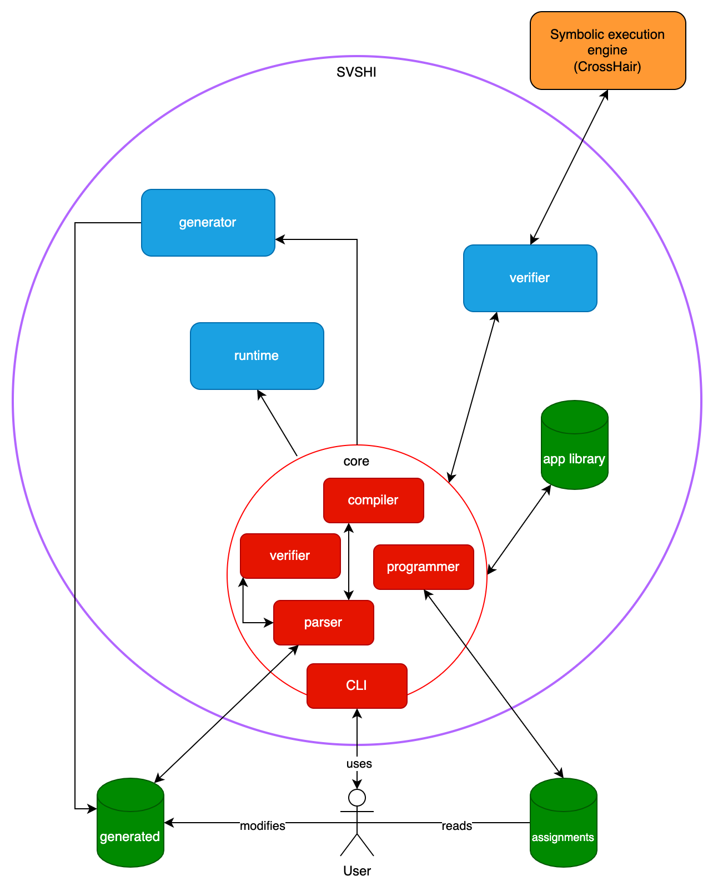

# White paper

- [White paper](#white-paper)
  - [1 Why does SVSHI exist?](#1-why-does-svshi-exist)
    - [1.1 Risk stories](#11-risk-stories)
      - [1.1.1 Hot water temperature issues in homes](#111-hot-water-temperature-issues-in-homes)
      - [1.1.2 CO2 levels in buildings](#112-co2-levels-in-buildings)
    - [1.2 KNX background](#12-knx-background)
      - [1.2.1 KNX topology](#121-knx-topology)
      - [1.2.2 KNX telegram](#122-knx-telegram)
      - [1.2.3 Functionality and group addresses](#123-functionality-and-group-addresses)
      - [1.2.4 KNX devices](#124-knx-devices)
      - [1.2.5 KNX Datatypes](#125-knx-datatypes)
      - [1.2.5 Configuration and ETS](#125-configuration-and-ets)
      - [1.2.6 KNX Pros and Cons](#126-knx-pros-and-cons)
      - [1.2.7 Why KNX?](#127-why-knx)
    - [1.3 State-of-the-art](#13-state-of-the-art)
    - [1.4 Current issues](#14-current-issues)
      - [1.4.1 Time-consuming configuration](#141-time-consuming-configuration)
      - [1.4.2 Cumbersome and error-prone project evolution](#142-cumbersome-and-error-prone-project-evolution)
      - [1.4.3 Lack of tools for complex behaviours](#143-lack-of-tools-for-complex-behaviours)
    - [1.5 How do we solve them](#15-how-do-we-solve-them)
  - [2 Who is SVSHI for?](#2-who-is-svshi-for)
    - [2.1 Whom does SVSHI help?](#21-whom-does-svshi-help)
    - [2.2 How?](#22-how)
      - [2.2.1 Developing apps](#221-developing-apps)
        - [2.2.1.1 Writing apps](#2211-writing-apps)
        - [2.2.1.2 App example](#2212-app-example)
      - [2.2.2 Running apps](#222-running-apps)
    - [2.3 What kind of productivity benefits could one expect](#23-what-kind-of-productivity-benefits-could-one-expect)
  - [3 What's new in SVSHI?](#3-whats-new-in-svshi)
  - [4 How does SVSHI work?](#4-how-does-svshi-work)
    - [4.1 Structure](#41-structure)
    - [4.2 App installation pipeline](#42-app-installation-pipeline)
    - [4.3 Implementation](#43-implementation)
      - [4.3.1 App generation](#431-app-generation)
        - [4.3.1.1 Prototypical structure](#4311-prototypical-structure)
      - [4.3.2 Compilation](#432-compilation)
      - [4.3.3 Verification](#433-verification)
        - [4.3.3.1 Symbolic execution](#4331-symbolic-execution)
        - [4.3.3.2 CrossHair](#4332-crosshair)
          - [4.3.3.3 AppState tradeoff](#4333-appstate-tradeoff)
        - [4.3.3.4 CrossHair in SVSHI and code modification](#4334-crosshair-in-svshi-and-code-modification)
        - [4.3.3.5 DPT and types](#4335-dpt-and-types)
        - [4.3.3.6 Runtime verification](#4336-runtime-verification)
      - [4.3.4 KNX Programming](#434-knx-programming)
      - [4.3.5 Execution](#435-execution)
        - [4.3.5.1 Code manipulation](#4351-code-manipulation)
        - [4.3.5.2 Runtime](#4352-runtime)
  - [5 Prototype & evaluation](#5-prototype--evaluation)
    - [5.1 Lab prototypes](#51-lab-prototypes)
    - [5.2 Accomplishments](#52-accomplishments)
    - [5.3 Limitations](#53-limitations)
    - [5.4 Future work](#54-future-work)
  - [6 Why you should contribute to SVSHI](#6-why-you-should-contribute-to-svshi)
  - [7 References](#7-references)

The paper is organized as follows. In [Section 1](#1-why-does-svshi-exist), we briefly describe what leads to the development of SVSHI. [Section 2](#2-who-is-svshi-for) explains who is SVSHI for and how it can be used. In [Section 3](#3-whats-new-in-svshi), we present what is new in SVSHI compared to existing solutions. In [Section 4](#4-how-does-svshi-work), we give an overview of the project's structure and implementation. [Section 5](#5-prototype--evaluation) discusses the real-life prototypes we developed, evaluates what SVSHI offers in the current state and what can be added in the future. We conclude our work in [Section 6](#6-why-should-you-contribute-to-svshi) with motivation on why should one contribute to SVSHI.

The source code is available [online](https://github.com/dslab-epfl/smartinfra).

## 1 Why does SVSHI exist?

**Smart infrastructures** are becoming more and more popular nowadays [[1]](#1). They usually interconnect devices such as HVAC (Heating, ventilation, and air conditioning), blinds, windows, lights, PAC (Programmable Automation Controller), security, health monitoring and switches to implement complex behaviors and automate tasks based on measurements and physical feedback.  
Common use cases are commercial and domestic buildings, such as hospitals, factories and houses.  
Additionally, the Internet of Things' advent is also contributing to this field's growth, with an ever increasing amount of connected and affordable devices.

Several protocols and standards are used in smart buildings. They are divided into wireless and wired protocols. In the former set we can find Wi-Fi, Bluetooth, [Zigbee](https://csa-iot.org) and [Z-Wave](https://www.z-wave.com), while in the latter mainly [KNX](https://www.knx.org/knx-en/for-professionals/What-is-KNX/A-brief-introduction/), [Insteon](https://www.insteon.com) and [Velbus](https://www.velbus.eu/domotica/).  
KNX is one of the most widely used for large installations with thousands of devices, such as the industrial ones; wireless protocols are deployed instead primarily for more "toy" installations with very few devices inside homes, as they can interact easily with smart home assistants such as Google Home and Amazon Alexa.

Becoming increasingly similar to a computer, the building has to face analogous challenges in terms of security, safety, reliability and correctness. Even [the most stable, mature and used standard](#29), KNX, is lacking in this area, with [severe issues](#13-current-issues) that hinder its usability and dependability when programming advanced systems.

This project stems from the desire of solving these issues and demonstrating that reliable and complex applications can be easily written for smart buildings, with the end goal of offering a 100% secure and verified platform for managing smart infrastructures.

In this work, we thus present **SVSHI** (**S**ecure and **V**erified **S**mart **H**ome **I**nfrastructure), a platform/runtime/toolchain for developing and running formally verified smart infrastructures, such as smart buildings, smart cities, etc.

Our main contributions consist in an open-source project that empowers KNX professionals and hobbyists to develop and run Python applications that are formally verified in a smart infrastructure, together with 3 real-life prototypes that exemplify what is currently achievable. To our knowledge, this is one of the first works to investigate the formal verification of software running in smart buildings and to propose a platform to program KNX installations in a high level language.

### 1.1 Risk stories

In this section, we present two risk stories that highlight potential problems due to misconfiguration in smart infrastructures and the importance of their verification.

#### 1.1.1 Hot water temperature issues in homes

Water temperature inside domestic water heaters presents two conflicting risks: the risk of contracting _Legionella_, the bacteria responsible for Legionnaires’ disease[^1], and the risk of scalding.

[^1]: <https://en.wikipedia.org/wiki/Legionnaires%27_disease>) (_pulmonary legionellosis_

**Legionnaires' disease** is a dangerous illness, with death rates up to 12% [[10]](#10). The elderly, smokers, the immunocompromised and patients suffering from chronic respiratory illnesses are the main groups at risk, and they include a large share of the population at home.

Residential drinking water supply is often the main cause for legionellosis [[12]](#12) [[13]](#13) [[14]](#14).

_Legionella_ proliferates in water at temperatures up to 45°C, and does not replicate above 55°C. Therefore, the WHO recommends to store hot water at 60°C inside the water heater by ensuring, at least once a day, the temperature reaches at least 60°C in the entire tank [[15]](#15).

Moreover, to avoid **scalding**, tap water should not exceed 49°C; this can be achieved with antiscald devices [[10]](#10).

Thus, a smart home needs to be properly configured to satisfy these requirements, as failure to do so could have severe consequences.

The importance of a system like SVSHI is therefore clear; **SVSHI can prevent the described problems** by:

- Statically verifying that the programming of the KNX system respects the recommended temperatures.
- Automatically enforcing the safety condition in an app.
- Dynamically verifying (at runtime) that the recommended temperatures are preserved.

#### 1.1.2 CO2 levels in buildings

Another important issue is related to CO2 levels in buildings.

**CO2 levels** inside buildings such as offices and schools are very important, and should be constantly monitored.

Increased indoor CO2 levels are strongly associated with symptoms such as fatigue, eye symptoms, headache, nasal symptoms, respiratory tract symptoms, and total symptom scores [[16]](#16). Also building ventilation rates are positively associated with the cited symptoms [[16]](#16). Furthermore, significant exposure-response relationships have been measured between CO2 concentration and respiratory symptoms, like sore throat, tight chest, irritated nose and sinus, combined mucous membrane symptoms and wheeze [[17]](#17).

Moreover, CO2 can be used as an indicator for poorly ventilated rooms, in which the concentration of microorganisms like viruses increases easily. This leads to [higher chances of diseases spreading in a room](https://www.gov.uk/government/publications/covid-19-ventilation-of-indoor-spaces-to-stop-the-spread-of-coronavirus/ventilation-of-indoor-spaces-to-stop-the-spread-of-coronavirus-covid-19), which has been put on the spot during the COVID-19 pandemic.

A possible solution to this problem is to keep indoor CO2 concentrations below 1000 ppm, the [American Society of Heating, Refrigerating and Air-Conditioning Engineers (ASHRAE) action level](https://www.ashrae.org/File%20Library/Technical%20Resources/Standards%20and%20Guidelines/Standards%20Addenda/62.1-2016/62_1_2016_d_20180302.pdf).

**SVSHI can be easily used to this end**, by:

- Statically verifying that the programming of the KNX system respects the threshold.
- Automatically enforcing the safety condition with an app.
- Dynamically verifying (at runtime) that the threshold is never reached.

### 1.2 KNX background

KNX is a communication protocol designed to interconnect buildings devices. The basic idea is to connect all devices to a bus on which they can exchange packets of information called _telegrams_. Devices can then send or receive telegrams and react to them. Various physical links technologies can be used for the bus, the most used being a twisted pair cable. Other possible physical links are radio frequencies for wireless implementations, IP (so ethernet cables or Wi-Fi) and power lines (i.e., used modulation of the electrical current in a standard installation).

#### 1.2.1 KNX topology

The KNX bus is split into different parts according to a particular _tree_ topology. That means that the bus cannot form a cycle.

The basic structure is the **line**. Each line consists of a power supply, a line repeater (if the complete bus contains more than one line) and up to 64 devices (including repeaters). It is theoritically possible to extend a line to contain up to 256 devices using more repeaters but it is better practice to split the bus in multiple lines if that many devices are needed.

Up to 15 lines can then coupled together to form an **area**. An area line links together area couplers to which lines are connected.

Up to 15 areas can be coupled to the **main line** which forms the backbone of the installation. The main line and the areas form a complete system.

This architecture helps managing the system at a human level by compartmentalizing the devices into distinct groups. This also allows the repeaters and couplers to filter telegrams according to their destination addresses to reduce traffic.

An **individual address** (also called **physical address**) is assigned to each device on the bus following the topology above. This address is of the form: **A.L.D** where **A** is the number of the area, **L** is the number of the line in the area and **D** is the number of the device on the line.
In binary, the individual address is therefore of the form: **AAAA.LLLL.DDDDDDDD** since A's and L's values are between 0 and 15, and D's between 0 and 255.
Couplers always have the number 0 on their respective line: (**A.L.0**).

KNX over IP can be used in place of the main line and of area lines. Lines connected to devices must be twisted pairs (or radio frequencies for compatible devices). This is done using KNXnet/IP interfaces that have one Ethernet port and one connection to the bus.
KNX over IP can be used to interconnect multiple buildings together, e.g. for public administrations.
Most KNXnet/IP interfaces nowadays support tunneling mode which means that they can be used to program devices using ETS (see below).

<p align="center">
  
</p>

Here is an example of a KNX topology mixing up different technologies together:

<p align="center">
  
</p>

#### 1.2.2 KNX telegram

**KNX telegrams** are the information packets that transit on the KNX bus. Sensors send telegrams and actuators react to them.
Their structure varies from a physical link to another. Here we develop only the structure of telegrams over twisted pairs.
A telegram is structured in fields, each field being composed of a certain number of bytes:

- Control field: contains the priority of the telegram and whether or not it was repeated
- Address field: specifies the **individual address** of the sender and the destination address (**individual address** or **group address** (see below))
- Data field: contains the telegram's payload (up to 16 bytes)
- Checksum field: checksum for the parity check

<p align="center">
  
</p>

#### 1.2.3 Functionality and group addresses

As previously said, devices can send and receive **KNX telegrams** over the **KNX bus**. Now we develop how devices are programmed to interact together to implement a particular piece of functionality.

First of all, the KNX system works in a completely decentralized way: devices send and receive telegrams on their own without any centralized authority regulating the exchange. That means that a device failure does not impact devices that are not relying on the failing one to do their job.

To implement functionality, the KNX protocol offers the concept of **group addresses**. These are multicast addresses. This means that a device is configured to send a telegram to a particular group address at a specific event (e.g., when a push button is pressed, send "on" or "off") and other devices that are programmed to react to this same group address will process the telegram.
Devices ignore telegrams that target group addresses they are not programmed to react to.

Group addresses can be seen as _virtual cables_ linking devices together to implement functions. Each group address corresponds to ONE function. To understand this, let us develop an example: in an office, there are two lights that work independently. We want to be able to turn on or off light 1 and light 2 individually but also both together with another button. There are then 3 _functions_: "light 1 on/off", "light 2 on/off“ and "light 1 and 2 on/off". Each of them must be assigned to a different group address. Then, buttons can be assigned to one of the three depending on what they should do.

Group addresses have multiple possible styles: 3-levels, 2-levels or free. Each project uses only one style for its group addresses. Regardless of the style, there are 65 536 possible group addresses [[2]](#2).

The most used style is the 3-levels. Using it, group addresses have the following form: **X/Y/Z** where X represents the _main group_, Y the _middle group_ and Z the _sub group_. In this mode, the ranges are [[2]](#2):

- 0 <= X <= 31,
- 0 <= Y <= 7
- 0 <= Z <= 255

In the 2-level mode, there are only the _main_ and _sub group_ with the following ranges [[2]](#2):

- 0 <= X <= 31,
- 0 <= Z <= 2047

Using the free style, the user can create an arbitrary number of _ranges_ with the capacity she wants. These ranges can nested. The number of addresses still cannot exceed 65 536.

#### 1.2.4 KNX devices

The name "**KNX device**" represents any device that can be connected to the bus. There are two types:

- **System devices**: these are the devices part of the KNX backbone, useful to the KNX system itself like power supplies, couplers, USB interfaces, KNXnet/IP interfaces, etc.
- **End devices**: these are the devices that use KNX to work (sensors and actuators)

There exist two categories of end devices:

- Sensors: devices that detect events and transmit information on the bus
- Actuators: devices that react to information on the bus and modify some physical world state

A majority of devices nowadays fall in both categories. For example, a HVAC (Heating Ventilation Air Conditioning) controller can modify the HVAC system state and also retrieve information about the system like current water temperature and send it on the bus. Thus it is a sensor and an actuator at the same time.

An end device is composed of two parts: the _Bus Coupling Unit_ (or BCU) and the _Bus Device_. The BCU is responsible of the communication on the bus and so of the KNX protocol implementation while the Bus Device is the device itself (e.g., a push button, a light actuator, etc.). They are connected by a _Physical External Interface_ (or PEI) of generally 10-12 pins.

The BCU itself is composed of a _Transmission module_ and a _Controller_. The transmission module determines through which medium the device can be connected to the bus (i.e., it is different for each bus physical link technology); the controller is a micro controller responsible of the implementation of the KNX protocol.

End devices are manufactured by a large variety of manufacturers and can be simple or advanced. A device of the same family (e.g., push button) can be very different from a manufacturer to another. Some devices offer multiple settings and features while others of the same nature are very basic.
For example, a push button can be just a simple on/off sensor but it can also provide additional options like a timer to delay the sending of the state change on the bus (e.g., to turn off basements' lights only when the user arrives at the top of the stairs when the button is at the bottom). Moreover the structure of the settings in ETS (see next section) can be very different from a brand to another because there are no clear guidelines.

#### 1.2.5 KNX Datatypes

KNX defines some datatypes (also called `DPT`). Each communication object has a datatype associated. Datatypes are named as follows: **DPT-X-Y**. The **X** corresponds to the type of the data: the format and the encoding. The **Y** defines the range and the unit of the value. For example, DPT-1 corresponds to boolean values, encoded on 1 bit. Then, the **Y** value in DPT-1-Y indicates whether the value is a _switching_ value or a _move up/down_ value for example.

Here is the list of the most used DPTs:

- 1.yyy = boolean, like switching, move up/down, step
- 2.yyy = 2 x boolean, e.g. switching + priority control
- 3.yyy = boolean + 3-bit unsigned value, e.g. dimming up/down
- 4.yyy = character (8-bit)
- 5.yyy = 8-bit unsigned value, like dim value (0..100%), blinds position (0..100%)
- 6.yyy = 8-bit 2's complement, e.g. %
- 7.yyy = 2 x 8-bit unsigned value, i.e. pulse counter
- 8.yyy = 2 x 8-bit 2's complement, e.g. %
- 9.yyy = 16-bit float, e.g. temperature
- 10.yyy = time
- 11.yyy = date
- 12.yyy = 4 x 8-bit unsigned value, i.e. pulse counter
- 13.yyy = 4 x 8-bit 2's complement, i.e. pulse counter
- 14.yyy = 32-bit float, e.g. temperature
- 15.yyy = access control
- 16.yyy = string -> 14 characters (14 x 8-bit)
- 17.yyy = scene number
- 18.yyy = scene control
- 19.yyy = time + data
- 20.yyy = 8-bit enumeration, e.g. HVAC mode ('auto', 'comfort', 'standby', 'economy', 'protection')

#### 1.2.5 Configuration and ETS

To configure KNX devices, the person installing a KNX system (we call her the "programmer") needs to use ETS. ETS is a software provided by the KNX association. It is closed source and not free.

Each manufacturer provides a KNX catalog entry for each of its devices.

The programmer then represents the whole system in ETS, following the topology formed by the devices in the real building. Each device added in ETS must correspond to the exact model installed in the building (using the manufacturer's catalog entry).

Once each device is entered in ETS, the programmer configures them to achieve the wanted behaviour for the building. She creates a group address for each function (as explained in [Section 1.1.3](#113-Functionality-and-group-addresses)).

Each device exposes _communication objects_ that are like IO ports for the device. Each communication object can be linked to one or more group addresses (only one is allowed for those which _read_ the telegrams, i.e., actuator, but more than one are allowed for those which _write_ telegrams, i.e., sensors).  
For example, a push button will at least expose a communication object "on/off state" that is like an output port connected to the bus that writes to the configured group address every time the state changes. The communication objects can be input, output or both.  
Devices also have settings that have to be modified in ETS. These settings can include parameters about the frequency at which updates are sent to the bus, whether or not the feedback should be sent (i.e., for an actuator sending its current state to the bus), complex settings about its behaviour, etc. These settings are, as explained by the domotic expert we met, the trickiest part about the configuration of a KNX installation. They are designed freely by the manufacturers, meaning that there is no uniformity across brands. Programmers must then learn how to configure each device by reading the documentation (also no uniformity there), which takes a lot of time.

One important aspect to note is that the rules that dictate the behaviour are never represented or stored in ETS. The rules are generally written down in some document the programmer receives from the client (or designs herself) but they do not have any machine readable representation related to ETS. This means that, only having the ETS project and configured devices, it is not possible to get back the rules. There is also no direct relation between the rules and the actual configuration in ETS, therefore errors can easily be made by doing the "translation", which can lead to unwanted behaviour of the final installation.

Once the configuration in ETS is done, the programmer can download to each device its own settings. The first time a device is configured, it must receive its individual address (see [Section 1.1.1](#111-KNX-topology)). For this step, a button must be physically pressed on the device to allow the individual address setting. For consequent application downloads, this is not necessary. ETS downloads the configuration to each device following the manufacturer's catalog entry by writing values in the device memory through commands sent on the bus.

After the application download is done, devices start sending and reacting to telegrams and the building is configured.

One should never lose the ETS project file because it is impossible to infer it from the devices. Thus, if the project file is lost, everything has to be done again from scratch.

#### 1.2.6 KNX Pros and Cons

In this section, we develop advantages and disadvantages of KNX as a smart buildings' backbone.

The biggest advantage of KNX is its reliability. The protocol indeed relies on simple electrical cables, a lot simpler than ethernet one for example. The installation is almost as stable and reliable as a traditional electrical installation. Another aspect that improves reliability is the certification system: each device is tested and aproved by the KNX association to get the "KNX-certified" logo [[3]](#3). KNX certified devices are thus tested by a third party and not just the manufacturer, which helps improving quality and reliability of devices.

Another advantage of KNX is its distributed architecture. This means that if a device fails, the rest of the system that does not depend on this device continues to work normally.

The KNX protocol has some downsides too.
The first major one is the price. Devices cost generally more than similar devices for traditional installations. This means that the cost of a KNX installation is greater than the one of a standard electrical installation, which leads to low adoption rate for domestic usage.

Even if the KNX bus over radio frequencies exists in the specification, in practice, there exists almost no devices compatible. The KNX system uses thus mainly cables. This can be a problem in some special buildings but it is mainly an obstacle to retrofitting. It is indeed painful to install the bus cable in a building where it was not done at construction time.

Configuration is also an issue: it must be done using ETS, which is time-consuming and painful to use. Moreover, the translation of the rules to devices settings is completely non-trivial. Experience with the system and devices is required to be able to exploit their full potential and to implement the desired functionality. Therefore, an expert is often required to configure even simple buildings like houses and thus, end users are not confident enough to do modifications to their own installation.

The KNX certifications are a good point for reliability but this leads to business exploitations that are a disadvantage for the hobbyists. The licensing and certifications are expensive and the association has the habit of giving them only to professional electricians [[4]](#4). Therefore, the public lacks some documentation and needs to use proprietary software to use an open protocol and system.

#### 1.2.7 Why KNX?

In this section we develop why we decided to develop a solution around KNX.

First of all, KNX is the most widely used system for smart buildings [[1]](#1). KNX market growth is a good indicator of its adoption and of the confidence that the industry has in this standard [[30]](#30). Moreover, as explained in [Section 1.1.6](#116-KNX-Pros-and-Cons), the system is simple and reliable, meaning that a current installation will still be usable in 10 or 20 years. The KNX standard indeed exists since 1999 [[2]](#2) and inherits from the EIB (European Installation Bus) system which was created in 1987 [[5]](#5). KNX is thus "here to stay", especially compared to more consumer-based solutions like Google Home or Apple HomeKit which might not exist anymore in their current form (if at all) a few years from now. As we want our solution to evolve in the future to be a real contender for the industry and the public, we need to rely on stable technologies.

Secondly, and related to the first point, since we want to develop a solution to provide reliable and verified smart infrastructures, we need to rely on a technology that is itself reliable. KNX is thus a good candidate.

We also want our solution to be usable for industrial applications (e.g., hospitals, facilities, public administration, etc.). Therefore, consumer-based solutions are not an option.

We also want our solution to be usable for industrial applications (e.g., hospitals, facilities, public administration, etc.). Therefore, consumer-based solutions are not an option.

KNX is also not a popular research subject. We could not find significant current research work and we therefore see an opportunity to propose something new and valuable for this technology.

### 1.3 State-of-the-art

This section contains a brief overview of the current smart infrastructures state-of-the-art and SVSHI related work.

There are few modern programming languages that support communication with KNX using some libraries: Java (and more generally the JVM ecosystem) with Calimero[^6], Python with XKNX[^7] (the library SVSHI uses) and Go with knx-go[^8]. They allow to interact with KNX mainly via KNXnet/IP and offer different degrees of abstraction.

[^6]: https://calimero-project.github.io/
[^7]: https://xknx.io/
[^8]: https://github.com/vapourismo/knx-go

Either on top of the above libraries or via custom-made solutions, various commercial and open-source building automation software systems have been built, such as Thinknx[^9], ComfortClick[^10], Weble[^11], openHAB[^12] and Homey[^13]. They usually provide a central unit that integrates with different kinds of devices, systems and standards, allowing to define rules and scenes. A typical use case is to create behavior that depends on both KNX and non-KNX devices. Compared to SVSHI, they need the KNX system to be already configured, they do not provide any form of formal verification and complex behaviors and app invariants cannot be implemented in a high-level programming language such as Python.

[^9]: https://www.thinknx.com/v4/en/
[^10]: https://www.comfortclick.com/
[^11]: https://www.weble.ch/
[^12]: https://www.openhab.org/
[^13]: https://homey.app/en-us/

SmartHomeNG[^5] is a metagateway that interconnect several things together. It supports KNX and is used as a gateway between several protocols. Other supported protocols include HomeMatic, EnOcean, 1-wire, DMX, Philips Hue, MQTT, etc. It is written in Python.

[^5]: https://www.smarthomeng.de

Research about KNX is rare and has been in decline in recent years. Even rarer is research involving KNX and formal verification; an exception is the paper by [Shehata and Al. (2007)](#19), who propose a way to deal with policies that can interact badly and induce unexpected behavior. Their solution is a run-time policy interaction management module for detecting and resolving interactions among user policies in KNX-based smart homes. It runs in the ETS software and is used at programming time.

Another interesting work on the KNX standard was done by [Ruta et Al. (2011)](#20), who propose a modification of the KNX stack to add a micro layer for semantic and enable autonomous decisions by the devices rather than explicit user commands.

Publications concerning formal verification in smart buildings are more common. [Sun et Al. (2017)](#21) present a lightweight rule verification and resolution framework for verifying the correctness of rules used by wireless sensor-actuator networks. It uses knowledge bases and anomaly detection.  
[Trimananda et Al. (2020)](#22) study conflicts between apps on Samsung SmartThings[^2], a platform for developing and deploying smart home IoT devices. Their findings suggest that the problem of conflicts between smart home apps is serious and can create potential safety risks. They also developed a conflict detection tool that uses model checking to automatically detect conflicts.

[^2]: https://www.smartthings.com/

[Grobelna et Al. (2017)](#23) focus on the design and verification methods of distributed logic controllers supervising real-life processes. In their work, Petri Nets[^3] are used to model the control system with all the transitions. The resulting net is then formally verified with the application of model checking techniques against predefined behavioral requirements.

[^3]: https://en.wikipedia.org/wiki/Petri_net

[Garcia-Constantino et Al. (2018)](#25) leverage Petri nets too. They use them to model elderly daily activities such as cooking pasta, making coffee and tea etc. Then, different scenarios are verified to understand whether they could possibly indicate an abnormal behavior, which can be used by the system to send alarms.  
[Corno et Al. (2011)](#24) propose a design time methodology for the formal verification of Intelligent Domotic Environments. Their approach is based on modeling the system and its algorithms with UML 2 State Charts[^4] and formally verifying them by checking logical properties expressed in temporal logic by model checking tools.

[^4]: https://sparxsystems.com/resources/tutorials/uml2/state-diagram.html

Machine learning applications in smart infrastructures are an important research subject as well. [Chatrati et Al. (2020)](#26) propose a smart home health monitoring system that helps to analyze the patient’s blood pressure and glucose readings at home and notifies the healthcare provider in case of any abnormality detected. Hypertension and diabetes are predicted with conditional decision-making and machine learning approaches.  
[Li et Al. (2019)](#27) work, in the field of building FDD (data-driven fault detection and diagnosis), consists in an expert knowledge-based unseen fault identification method to identify unseen faults by employing the similarities between known faults and unknown faults.  
[Dey et Al. (2020)](#28) present an extraction method to deal with HVAC terminal unit. Machine learning is employed for fault detection and diagnosis in building.

### 1.4 Current issues

KNX is stable and well established. We however identified three main issues which slow down adoption rate and what is achievable using KNX. We expose and explain here these three points.

#### 1.4.1 Time-consuming configuration

The configuration of a KNX installation is time-consuming. As we explained in [Section 1.1.5](#115–Configuration-and-ETS), all the configuration takes place in ETS. This software is well developed but the way the configuration is performed is outdated: every device must be configured individually and nothing can be automated. Moreover, as each device settings' structure is designed by the manufacturer, there exists no uniformity so the learning curve is steep.

As also explained earlier ([Section 1.1.5](#115–Configuration-and-ETS)), the rules that dictate the devices behaviour are not entered directly in the configuration. The translation between human described behaviours and the actual devices settings is done by hand. The two representations are completely different and thus the translation takes time and energy from the programmer.

The ETS project reflects _exactly_ the building's structure with all the devices and their locations, and thus is unique to the installation. That means that the work has to be done again from scratch (except the learning and experience accumulated, of course) every time the programmer begins a new project. It is a shame to not be able to reuse common configurations to gain time.

The configuration being that dissociated from the rules humans described, the probability of incorrect behaviours is high and so is the debug time. It is not rare that the programmer must come back to a project several times until everything settles.

#### 1.4.2 Cumbersome and error-prone project evolution

The evolution of a project is important: a building can be extended or devices added like a new HVAC system. Making a project evolvable is thus important and we think KNX does not provide a good enough solution.

First of all, the ETS project file must be accessible ([Section 1.1.5](#115–Configuration-and-ETS)). If the file is lost, the configuration cannot be extracted from the devices (except the group addresses but these are only a fraction of the total configuration). A programmer must then discuss with the users and observe the behaviours of the current installation before trying to reconstruct the ETS project as a new one. This alone restricts evolution for existing buildings. We discussed with a professional KNX programmer that explained that for a house this process is doable but, for an industrial building, it is an impossible mission and he always refuses this kind of projects.

Even if the ETS project file is available, evolution is not trivial. The new device must be added to the project and the new behaviour implemented. If the device works independently from the rest of the installation, this process is relatively simple, but if other existing devices are involved, it can become really tricky. More specifically, if the new device is tightly bound to existing ones, the work is almost as challenging as for a new configuration.

Old behaviours must be, of course, preserved and this is not trivial. The issue is amplified by the fact that there is no way to detect that an existing behaviour has been wrongly modified by a new one; it must be tested in the real installation. This can become dangerous when the existing behaviour involves critical systems such as hot water heating (as described in [Section 1.1](#11-risk-stories)), the ventilation of specific areas (e.g., hospital rooms) or access control for example.

#### 1.4.3 Lack of tools for complex behaviours

Using ETS and KNX devices, the range of possible functionality is limited. One can only connect devices' communication objects together using group addresses and configure devices settings (e.g., some delays, sensors' refresh frequency, repeating data sent, etc.).

This is sufficient for a large number of situations like blinds automation with a weather station, lights management, etc. As long as a device exists to implement the intended behaviour, this method would work.

However, what about Machine Learning based behaviours or functions that would connect to external services? For now, this is not possible using existing solutions. There exists servers (like _ComfortClick_ [[7]](#7)) that connect onto the KNX bus and let the programmer develop more complex rules but the programming language is not a standard one and ML and external services are not available. These solutions are not numerous and some of the existing ones are in end-of-life state (like _Lifedomus_ from DeltaDore [[6]](#6)).

There also exists logical module but these allow the programmer to design logic circuits using gates on a GUI inside ETS to connect in/out pin of the device to group addresses. This is cumbersome and extremely low level so these are not a viable option for advanced behaviours.

We think that the KNX ecosystem lacks a way to program in established programming languages or at least a way to enter complex sets of rules directly. It also lacks a way of verifying that a configuration is safe and implements the desired behaviour and does not provide a tool to check that this behaviour is preserved through updates of the installation.

### 1.5 How do we solve them

We solve the issue related to time-consuming configuration mainly by _reducing_ the amount of time users need to spend on ETS. In fact, most of the configuration is implicitly performed by developing the app, and SVSHI even outputs two files that describe what remains to be done on ETS after installing an application. Additionally, the rules describing the devices' behaviors are explicitly encoded in the apps by the user, and automatically used and enforced while executing. Moreover, apps can be reused and adapted with minimal changes, without the need of re-doing all the work from scratch, like in ETS. Overall, since the probability of committing errors is decreased and the amount of code written minimal, debugging and fixing mistakes become quick and simple tasks.

The second pain point, cumbersome and error-prone project evolution, is solved in multiple ways. First of all, a SVSHI distribution (including all installed apps) can be _version-controlled_, which means that it will be always accessible and rollbacks in case of errors are trivial. Furthermore, changing (or adding) a behavior is as simple as modifying (or creating) a short Python script. Finally, every app update or new installation is verified to make sure it does not break the current system, so compatibility and correctness are always ensured.

The mere SVSHI existence overcomes the last problem, the lack of tools for complex behaviors. With SVSHI and limited programming skills, it is possible to use _any_ Python library available and write _any kind_ of app needed; Machine Learning, external services, APIs are just some of the tools that can be leveraged in a SVSHI app with little effort and a high degree of abstraction.

## 2 Who is SVSHI for?

This section details SVSHI's intended audience and how the public can use SVSHI. It presents SVSHI from a user perspective. For more details about how SVSHI works, please see [Section 4](#4-How-does-SVSHI-work).

### 2.1 Whom does SVSHI help?

SVSHI helps both smart home enthusiasts and hobbyists wishing to tinker with their installation, and KNX professionals working on large business systems.

### 2.2 How?

SVSHI allows to develop and run Python apps in a KNX system. On top of that, it verifies that the apps adhere to a set of invariants provided by the user. No formal verification background is needed, the only requirement is some Python programming knowledge.

Thus, with SVSHI smart home _aficionados_ can control their smart home KNX installation without having to rely necessarily on experts, and can add easily pieces of functionality by writing or downloading apps without the fear of breaking the system.

In a similar fashion, KNX professionals and domotics experts can tackle bigger, richer and more complex projects, as the time gain with SVSHI is significant compared to an ETS-centric approach. Furthermore, the verification of the programs before deployment means no more surprises and no more afternoons of correcting errors. Finally, being able to add at any time pieces of functionality to the system by writing or downloading apps allows to smoothly evolve and improve projects, without headaches.

#### 2.2.1 Developing apps

As explained in the previous section, developing apps with SVSHI is easy and any Python library can be used. Additionally, the user has to spend less time on ETS.

To develop an app for SVSHI, a user has to:

1. Create the devices prototypical structure file containing the list of the devices the app should use, as explained in the [app prototypical structure](#4211-Prototypical-structure) section.
2. Run the app generator, as explained in the [app generation](#421-App-generation) section, to get the app skeleton. It will be created under the `generated/` folder.
3. [Write your app](#2211-writing-apps).
4. Run `svshi` to generate the bindings with `svshi generateBindings -f ets.knxproj`, where the argument is the _absolute_ path to the ETS project file.
5. Map the right physical ids given in `generated/physical_structure.json` to the right device in `generated/apps_bindings.json`. This is needed to provide the devices in the Python code with the group addresses to use. The first file represents the physical structure from the ETS project file, where each communication object has an id. The second one represents the apps structure with the devices and for each of them, the links they need.
6. Run `svshi` again to [compile](#432-compilation) and [verify](#423-Verification) the app with `svshi compile -f ets.knxproj`.

For more details on how SVSHI works under the hood, see [Section 4](#4-how-does-svshi-work).

##### 2.2.1.1 Writing apps

To write an app, the user mainly has to modify the `main.py` file, optionally adding dependencies into the `requirements.txt` file provided in the generated project. To understand how the project is generated, please refer to the [app generation section](#421-App-generation).

All the available device instances are already imported in `main.py`. They mirror what has been defined in the device prototypical structure file.

The application can use external files. They however need to have been declared in the prototypical structure json file and they have to be located at the root of the project, next to `main.py`.

There are two important functions in `main.py`, `invariant()` and `iteration()`. In the first one the user should define all the conditions (or _invariants_) that the entire KNX system must satisfy throughout execution of **all** applications, while in the second she should write the app code.

An important thing to be aware of is that `iteration()` cannot use external libraries directly. Instead, these calls have to be defined first inside _unchecked functions_, which are functions whose name starts with `unchecked` and whose return type is explicitly stated. Then, these functions can be used in `iteration()`.

In addition, note that `invariant()` must return a boolean value, so any kind of boolean expression containing the _read_ properties of the devices and constants is fine. However, here operations with side effects, external libraries calls and unchecked functions calls are **not** allowed.

**Unchecked functions** are used as a compromise between usability and formal verification, and as such must be used as little as possible: their content is not verified by SVSHI. Furthermore, they should be short and simple: we encourage developers to add one different unchecked function for each call to an external library. All logic that does not involve calls to the library should be done in `iteration()` to maximize code that is indeed formally verified.
Nonetheless, the user can help the verification deal with their presence by annotating their docstring with _post-conditions_.

Functions' **post-conditions** define a set of _axioms_ on the return value of the function: these conditions are assumed to be always true by SVSHI during verification. They are defined like this: `post: __return__ > 0`. You can use constants and other operations. You can add as much post-conditions as you like and need. Therefore, we encourage developers to avoid having conjunctions in post-conditions but rather to have multiple post-conditions. This does not make difference for the verification but helps the readability.  
However, keep in mind that these conditions are **assumed to be true** during formal verification! If these do not necessarily hold with respect to the external call, bad results can occur at runtime even though the code verification was successful!

An example with multiple post-conditions could be:

```python
def unchecked_function() -> int:
  """
  post: __return__ > 0
  post: __return__ != 3
  """
  return external_library_get_int()
```

Furthermore, applications have access to a set of variables (the _app state_) they can use to keep track of state between calls. Indeed, the `iteration()` function is called in an [event-based manner](#424-execution) (either the KNX devices' state changes or a periodic app's timer is finished). All calls to `iteration()` are independent and thus SVSHI offers a way to store some state that will live in between calls. There is a local state instance _per app_.

To do so, in `main.py` the `app_state` instance is imported along with the devices. This is a dataclass[^15] and it contains 4 fields of each of the following types: `int`, `float`, `bool` and `str`. The fields are called respectively `INT_X`, `FLOAT_X`, `BOOL_X` and `STR_X` where X equals 0, 1, 2 or 3. We made this design choice to simplify the verification, as explained in [Section 4.2.3.3](#4233-crosshair-in-svshi-and-code-modification).

[^15]: <https://docs.python.org/3/library/dataclasses.html>

These values can be used in `iteration()` and `invariant()`. One should be careful while using it in `invariant()` or in a condition that will affect the KNX installation's state (the _physical_ state): the formal verification would fail if ANY possible value of the `app_state` leads to an invalid state after running `iteration()` even if this case should not occur because of previous calls to `iteration()` that would have set the values.

##### 2.2.1.2 App example

In `main.py`:

```python
from instances import app_state, BINARY_SENSOR, SWITCH


def invariant() -> bool:
    # The switch should be on when the binary sensor is on or when INT_0 == 42, off otherwise
    return ((BINARY_SENSOR.is_on() or app_state.INT_0 == 42) and SWITCH.is_on()) or (not BINARY_SENSOR.is_on() and not SWITCH.is_on())


def iteration():
    if BINARY_SENSOR.is_on() or app_state.INT_0 == 42:
        SWITCH.on()
    else:
        SWITCH.off()
```

This application sets a switch on (a light for example) when a binary sensor is in "on" state (a push button for example) or when the `INT_0` value equals 42. The `invariant()` ensures that if these conditions are met, the switch is always in on state and if they are not, it is set to off.

#### 2.2.2 Running apps

To run all the installed apps (with [runtime verification](#4233-runtime-verification) enabled):

1. In [ETS](https://www.knx.org/knx-en/for-professionals/software/ets-professional/), import the file `assignments/assignment.csv` to create the group addresses, then assign to each communication object the right group address as presented in `assignments/assignment.txt`. The name of the group address should help understanding which device it is meant to.
2. In ETS, do a basic configuration of the devices to make them have the correct basic behaviour (the amount of configuration depends on the particular device)
3. Execute `svshi run -a address:port`, where address is the KNX IP gateway address and port is the KNX IP gateway port.

SVSHI logs which apps have been called during execution and which telegrams have been received. You can find the logs in `logs/`.

For more details on how apps are run, see [Section 4.2.4](#424-execution).

### 2.3 What kind of productivity benefits could one expect

With SVSHI, one can use any Python library to **develop any kind of app**: machine learning and external services can be leveraged in a **few lines** of Python. This kind of system complexity is either not achievable or very time-consuming in an ETS-only setting. Updates are **easier**, **faster** and **safer** to do, as the user just needs to modify the Python script, and the modifications are **formally verified**. In a larger perspective, one can expect **less errors** during the configuration of a KNX installation, and **less time spent on ETS**, since SVSHI does the heavy lifting for the user.

Moreover, the SVSHI system provides a runtime verifier module. This module verifies during the execution that the invariants cannot be violated. If an app does a modification that violates at least one invariant, the modification is not applied to the KNX installation and the app is killed. As this verification works on real values known at runtime, it can detect problems with `unchecked` functions too, even if it violates a post-condition the developer added. This gives a superior safety level and can catch all errors.

[Section 1.5](#15-how-do-we-solve-them) contains more details on this subject.

## 3 What's new in SVSHI?

This section discusses the **novelties** introduced by SVSHI.

SVSHI is the first platform that allows running Python applications in smart infrastructures. It provides the highest level of abstraction available at the moment for programming KNX systems, and it extends KNX possibilities beyond what was previously achievable: any behavior and complex integration is now possible.

Applications are decoupled from the physical system they are installed on, and can be developed independently. Only at installation time the binding between devices used in the app and real physical devices is established.

Additionally, while preserving performance and developer productivity, SVSHI formally verifies applications, ensuring their invariants are always preserved. App developers need no verification expertise, and the verification process does not require their assistance.

Furthermore, formal verification has been used before for smart homes, but it was never applied to Python apps running on KNX. Moreover, symbolic execution was seldom used with Python. SVSHI is then one of the rare applications that leverages it.

## 4 How does SVSHI work?

In this section, we first describe how SVSHI is structured, concluding with an in-depth explanation of the platform's internal implementation.

### 4.1 Structure

<p align="center">
  
</p>

SVSHI is made of different **Python** and **Scala** modules. In the above diagram, the Python modules are in blue, the Scala ones in red. Data stores are denoted in green.

We chose Python for the `generator`, `verification` and `runtime` modules since we need to perform code generation, AST manipulation, code execution and symbolic execution on Python files. Scala is used for all other tasks.

The user interacts with the infrastructure through a **command-line interface** (CLI) which is the only entrypoint. She also has access to the `generated` folder where apps that have been generated and in the process of being installed are stored together with their bindings, and to the `assignments` folder where group addresses assignments are saved for later use on ETS.

Installed apps, compiled and verified, are stored in the private `app_library` and can be modified or deleted only using the CLI.

### 4.2 App installation pipeline

To install an application on SVSHI, the following tasks are performed:

- First, the Compiler generates a configuration of the physical devices for the applications to work (and some other information for the Verifier and KNX Programmer)
- Then, the Verifier performs formal verification on the applications and the devices configuration
- If the verification is successful, the KNX programmer passes this configuration to the KNX system. At this point, the new application is installed
- If the verification does not pass, the current applications are kept as is and the developer must review the new application(s) before trying again

### 4.3 Implementation

In this section we describe the implementation of the different components of the system.

#### 4.3.1 App generation

The **app generator** produces a Python app skeleton given an app name and the app prototypical structure JSON file.

Before executing the app generator, the user needs to create the file containing the list of the devices the app uses, as explained below [in Section 4.2.1.1](#4211-Prototypical-structure).

To execute the generator, we run `svshi generateApp -d devices.json -n app_name`, where the first argument is the _absolute_ path to the prototypical structure file and the second one (`app_name` in the example) is the name of the app to create. The name has to follow the same rules as for Python modules: short, all-lowercase names. Underscores can be used if it improves readability.

The generator first parses the JSON file, extracting the list of devices (and failing if it has the wrong format). Then, it generates the app in several steps:

1. It creates a new directory in `generated`, if it does not already exist with the given name of the app.
2. It generates the file `instances.py` containing the devices' instances with their names capitalized and the app state instance.
3. It generates the file `__init__.py` in each sub-directory of the generated app, to make sure every folder is a Python module and can be used as such in imports. This step is a safety precaution in case the user has already started writing the app before generating it, which is not recommended but allowed.
4. It copies the predefined app skeleton to the newly generated app. The skeleton comprises the devices' models (`models` sub-module), the `requirements.txt` file and the `main.py` file.
5. It generates the `multiton.py` file, placing it in the `models` folder. This file contains a decorator that makes the decorated class a multiton: only a limited number of instances can exist. If a device instance with a given name already exists, it is returned instead of creating a new object. All devices' classes are multitons.
6. It **moves** the given prototypical structure file to the newly generated app, renaming it `app_prototypical_structure.json`.
7. Finally, it adds import statements in `main.py` for the newly created instances and the app state instance, so that the user can directly use them in `invariant()` and `iteration()`.

Part of the skeleton code is present to let the user use linters and run the code locally if needed. The code is then replaced during the installation process and is therefore not used by the SVSHI runtime component.

##### 4.3.1.1 Prototypical structure

This JSON file is given by the programmer/developer that wants to develop an application. It represents the prototypical devices that the app needs with their types. It also specifies whether the app is _privileged_ or not (`"permissionLevel": "privileged" | "notPrivileged"`). A privileged app overrides the behavior of the non-privileged ones at runtime.

Moreover, the `timer` attribute can be used to run the application even though the physical state has not changed. The app thus becomes a **periodic** app.

- If `timer == 0` the application runs only when the physical state of the devices it uses changes
- If `timer > 0` the application runs when the physical state changes AND every `timer` seconds.

The `files` attributes is used to indicate files that the app needs to work properly. These files must be at the root of the application project (next to `main.py`).

Once the app is generated, it is moved in the generated apps' folder.

Here is an example:

```json
{
  "permissionLevel": "notPrivileged",
  "timer": 60,
  "files": ["file1.txt", "file2.png"],
  "devices": [
    {
      "name": "name_of_the_instances",
      "deviceType": "type_of_the_devices"
    }
  ]
}
```

The `name` is used as the instance name in the Python app that is generated. It should then be unique in a given app, and should follow the Python variables naming conventions: no whitespaces nor numbers.
The `deviceType` should be supported by SVSHI.  
At the moment, the supported devices are:

- **Binary sensors** (deviceType = "binary")
- **Temperature sensors** (deviceType = "temperature")
- **Humidity sensors** (deviceType = "humidity")
- **CO2 sensors** (deviceType = "co2")
- **Switches** (deviceType = "switch")

#### 4.3.2 Compilation

The compilation is the part of the process of installing an application onto the system that produces the ETS configuration for the devices. Conceptually, it reads the applications and the bindings between physical and prototypical devices and outputs a configuration for the KNX devices and some files that are used by the verifier and the KNX programmer.

For now, the compilation that SVSHI performs happens in two steps. During the first one, the compiler generates a new file containing the bindings between physical communication objects and prototypical ones and the file containing the parsed physical structure. During the second phase, the compiler reads the binding file filled by the developer and assigns group addresses to each physical device communication object used at least by one application.

Let us describe more in depth these two phases.

During the first phase, the compiler generate a file containing bindings between physical and prototypical devices. The binding file is a json file that contains one object for each application that is installed or that is being installed. This object in turn contains one object for each prototypical device used by the application. Each of these objects for the devices contains the name and the type of the device and, more importantly, one integer for each communication object it exposes. This integer is an ID that is used to map the communication object to a physical one (each physical communication object has some ID in the `physical_structure.json` file the compiler also produced). The developer must fill this file with the corresponding IDs before continuing.  
One important part is the compiler's behaviour when generating this binding file when some applications are already installed. Indeed, it would not make sense to wipe all existing bindings when installing a new application. However, if the devices installed in the physical installation changed, it does not make sense to keep potentially staled mappings.  
Therefore, the compiler checks whether the passed physical structure at compile time (i.e., the ETS project file) produces a physical installation identical to the one stored in the currently installed application library or not. If the physical structures are identical, currently existing bindings are kept and new object(s) for the application(s) being installed are added. The developer has only to fill the bindings for the applications being installed. If the physical structures are different, all bindings are generated from scratch, old IDs are replaced by `-1` and the developer has to fill everything again, even for previously installed applications.

During the second phase, the compiler uses the binding file that was generated during the first phase and that the developer filled to assign group addresses to physical device communication objects. Doing so, these group addresses are also assigned to prototypical device communication objects that are mapped to physical ones.  
The compiler assigns a group address only to communication objects that are indeed mapped to at least one prototypical device.  
The compiler then generates a file containing the group addresses, the corresponding type in Python and the corresponding KNX datatype, which will be used by the runtime module.
The compiler also returns values that are used by the verifier to continue the process.

#### 4.3.3 Verification

Verification is part of SVSHI's DNA. We want to verify as much as possible that the applications and the bindings are correct.

##### 4.3.3.1 Symbolic execution

Let us start with some background about symbolic execution.

Symbolic execution is a different way of executing a program. Most of interpreters run program with concrete values (an integer would have the value 42 for example). When symbolically executing a piece of software, each variable takes a symbolic value which is a range of values that this variable could possibly take in a concrete execution. This way, a symbolic execution explores multiple (sometimes even all) possible concrete execution paths at once.

To explore paths, a symbolic execution engine adds at each branch a _path constraint_ that represents the conditions that must hold for the symbolic values of variables for that path to be followed. An execution path in the program is feasible if the set of all paths constraint (that is called the _path condition_) is satisfiable.

Let us take an example. In Fig. 5, the `abs` function has one branch. The symbolic execution will generate two path constraints, one for the `then` branch which is `x >= 0` and one for the `else` branch which is `x < 0`. This program also has two paths and both have a path condition that is satisfiable.

A symbolic execution engine will choose different satisfiable paths until the whole paths space is covered.

By using symbolic execution, it is possible to find faulty paths even if the probability of taking them during concrete execution is extremely low.

For example, again in Fig. 5, in the `succ` function, the symbolic execution will generate the path condition `x == 42768` and immediately detects that the path has a satisfiable path condition and therefore will directly find this faulty path. Whereas a concrete execution with random value for argument `x` only has 1 chance over 2^32 of finding this faulty path.

<figure align="center">
  
  <figcaption>Fig. 5 - Absolute value and faulty successor functions (taken from [[9]](#9) ).</figcaption>
</figure>

##### 4.3.3.2 CrossHair

CrossHair [[8]](#8) is a Python library that allows to analyse a Python program. It is based on the idea developed by Bruni et Al. in their paper [[9]](#9). They propose a way of implementing symbolic execution engines with few code by using the actual runtime engine of the language. In a nutshell, the main idea is to leverage primitive operation dispatching to implement proxy values that will be passed around in place of the concrete values (e.g., `int`, `bool`, ...). Python implements everything as method call: for example, `a + b` becomes `a.__add__(b)` so it is possible to "hijack" this method dispatching to replace primitive types by proxies. Doing so, it becomes possible to execute a function passing these proxy values instead of concrete values as arguments and record how these values are used.

Then, it can construct path constraints and path conditions for the program and use a SMT solver to explore paths and find counterexamples.

CrossHair proposes different "mode" of executions: `check`, `cover`, `diffbehavior` and `watch`. `watch` is an interactive version of `check` that runs in a terminal while one is coding in her favorite editor and gives live feedback and information every time she saves the file.

We present each mode, starting with `diffbehavior` and `cover` that we do not use for SVSHI and then `cover` that is indeed useful for us.

In `diffbehavior` mode, given two functions, CrossHair tries to find a set of arguments that make the two functions return different values. In other words, it tries to find whether two functions are identical in behaviour or not.

Using `cover` mode, CrossHair uses symbolic execution and the SMT solver to find inputs that leads to high op-code level test coverage.

In `check` mode, CrossHair uses symbolic execution to find whether _contracts_ hold or not for functions. Contracts are annotations in Python docstrings and are in fact pre- and post-conditions expressed as booleans expressions. The pre-conditions can restrict the range of values of the arguments and the post-conditions express what should hold at the end of the function execution (the special value `__return__` can be used to represent the value returned by the function). CrossHair then tries to find counterexamples, i.e., values for the arguments that satisfy the pre-conditions but violate the post-condition. If no such counterexamples are found after a timeout or if all _discovered paths_ are covered, CrossHair considers the contracts to be valid. Crosshair outputs a special message if contracts are _valid over all paths_ meaning that all discovered paths were analysed and not that the timeout was hit.

One caveat of CrossHair is the way it discovers paths. Indeed, as CrossHair discovers paths only by executing the function with these special proxy values as arguments, it only discovers all feasible paths for programs that are _deterministic_. That means that branches should not depend on external values other than arguments to be discoverable. Also, if a program has side effects, it could cause problems as they would be visible during the verification process.
Crosshair does not perform any AST analysis or similar, it really just executes the program with special proxy values as arguments.

CrossHair also requires the code to be typed. This is not really a limitation in our case as most of the code is generated so we add types automatically. We only require the developers to type `unchecked` functions.

CrossHair supports variables of type `int`, `bool`, `str` and `dict` at least [[18]](#18). We observe that it also supports `float`. CrossHair also supports `dataclasses` and custom classes if the attributes have one of the aforementioned types. During our experiments, we observe that counterexamples concerning `dict` were not found in almost all cases. We think that the available space is too large, accounting for the fact that Python dictionaries are heterogeneous and can have keys and values of any types (even different ones in the same dictionary).

###### 4.3.3.3 AppState tradeoff

As explained in [the section about how to write apps](#2211-writing-apps), applications have access to an `AppState` instance. This lets the applications store state that persists between calls to `iteration()` and `invariant()`.

Given our observation about how CrossHair deals with arbitrary dictionaries, we decided to not allow an arbitrary key-value store as we originally thought. Indeed, having an abitrary dictionary as `AppState` would have lead to ineffective verification and thus bugs that would have not been caught. We thus decided to propose a register-like data structure, with a finite number of values of each type for the following types: `int`, `float`, `str`, `bool`. The number of values can be increased in future versions of the platform. The fact that the types are known and that keys (here attribute names) are fixed helps during verification.

We think that the tradeoff is acceptable, as SVSHI gets effective verification of the applications at the cost of lesser free variable names and types.

##### 4.3.3.4 CrossHair in SVSHI and code modification

We develop here what we formally verify about applications written for SVSHI and how we modify them for the verification process to work.

First of all, we need to define what are the properties that should be verified about the applications. As described in the [section about app generation](#421-app-generation), the developer writes 2 functions in an application: `iteration()` and `invariant()`. The `iteration()` function is the function that modifies the state of the installation (i.e., what implements the behaviour) while the `invariant()` is a function that returns a `bool` and represents an invariant about the physical installation that must stay valid at any time.

When doing the verification, we have 2 sets of applications: the already installed one(s) and the one(s) being installed. The main idea is that we verify that the execution of the `iteration()` function of any application on a _valid state_ (i.e., the installation is in a state in which all `invariant()` functions of all applications of both sets are verified) returns a possibly different but still _valid_ state. This condition is more conservative than it could be. Indeed, it is possible that a particular set of applications is rejected even though the execution could be valid. This would occur if the execution of the `iteration()` functions in a particular order leads to a valid state but the state is in an _invalid state_ between two functions. We decide that this case should be rejected as well because of the event-based nature of our system. Indeed, it would lead to invalid states if the execution order changes. It also helps during the verification process using CrossHair and we will detail how. It is therefore possible to verify `iteration()` functions independently from each other.

An important thing to note as this point is that we cannot verify that, given a valid state, an app produces a valid state. Indeed, for an app to produce a valid state from an invalid one, the invalid one must be from a particular subset of the universe of all states. This represents in fact the _functionality_ of the app.

For example, let us take an application that turns a light on when a presence detector detects someone. The app would look like this:

```python
def invariant():
  if PRESENCE.is_on():
    return LIGHT.is_on()
  else:
    return not LIGHT.is_on()

def iteration():
  if PRESENCE.is_on():
    LIGHT.on()
  else:
    LIGHT.off()
```

Here, at some point in the execution, the presence will be `on` because someone has just arrived but the light will be `off` because it is exactly _this_ app that should set it to `on`. Thus, the state is invalid before app execution but valid after. The described scenario however cannot be verified using CrossHair because only some of the invalid states lead to valid ones after executing the apps. Some of the invalid states will stay invalid and this is a normal behaviour. Therefore, to catch these errors, we implemented the [runtime verification](#4233-runtime-verification)).

`iteration()` and `invariant()` functions are using instances of classes that represent the devices of the installation and that are communicating with KNX through the network. Given the nature of CrossHair, the code cannot use values that have to be read over the network. Moreover, as explained in the [section about CrossHair](#4232-CrossHair), the code must not have side effects. Therefore, we need to modify the code written by the user to make it verifiable. We list and explain in details all the modifications that we operate on the code.

First of all, we need a way to pass the state of the installation and the AppState as argument. Indeed, we want to define contracts on the states and we want the states to be symbolically represented to explore all cases. We define a class `PhysicalState` that holds the state of the installation as abstract values. For example, if the physical installation contains a push button, a light and a temperature sensor, the `PhysicalState` will holds 2 `bool` values (for representing the current state of the light and the push button) and 1 `float` value (that represents the temperature measured by the temperature sensor). This `PhysicalState` is defined as a `dataclass` in Python. We do the same for the `AppState` which is a `dataclass` with a finite number of values for each supported basic type. We modify the Python code of the `iteration()` and `invariant()` functions using the Python AST module to take an instance of `PhysicalState` and an instance of `AppState` as argument. We also modify the code to pass the `PhysicalState` instance to all functions that act on devices, so that modifying the state of a device changes the instance of `PhysicalState` and getting the state of a device returns the value hold by it.

We then modify `iteration()` to return a `dict` that contains the modified instances of `PhysicalState` and of `AppState` so that contracts can be written about them. We return a `dict` with, as keys, the strings that contain the respective names of arguments of the `invariant()` functions. By doing so, we can call `invariant()` functions more easily with the `fun(**dict_with_named_args)` notation.

As explained in the [previous section about CrossHair](#4332-CrossHair), functions passed to it must be _pure_, i.e. have _deterministic_ behaviour and no side effects. However, we want applications to be able to use external services. We therefore decided to ask developers to write all the code that contains external calls in functions whose names are prefixed with `unchecked`. These functions must have an explicit return type for the verification to work. During the code modification step, we pass to the `iteration()` function one new argument for each of those functions, of the corresponding type (if the return type is not `None`, in which case the call is just replaced by `None` directly). In this way, the values returned by those functions are represented by symbolic values during verification and all cases are explored. To aid verification and avoid false negatives, developers can add `contracts` in the form of post-conditions to these `unchecked` functions. Developers must however be very careful with these contracts because, if they are not respected at runtime by the external call, errors might occur even though the formal verification passed. `invariant()`functions cannot use `unchecked` functions.

Now that the `iteration()` function acts on an abstract representation of the states that can be symbolically represented and on `unchecked` functions corresponding arguments, we need to add contracts that CrossHair will verify. First, we add as pre-conditions all the invariants of all applications of both sets (to represent that the passed states are valid) and the post-conditions of the `unchecked` functions. Then, we add as post-conditions all the invariants of all applications of both set but called on the return value of the `iteration()` function, to verify that given a valid state and unchecked functions values, the return state is still valid.

We then call CrossHair to verify contracts for all `iteration()` functions. If CrossHair finds a counterexample for at least one of them, we reject the whole set of applications being installed.

Here is an example of the `iteration()` function of an application before (as written by the developer) and after manipulation (as passed to CrossHair):

Before:

```python
def iteration():
    if not PRESENCE_DETECTOR.is_on() and not DOOR_LOCK_SENSOR.is_on():
        if app_state.INT_0 > 5:
            unchecked_send_message("The door at office INN319 is still opened but nobody is there!")
        else:
            app_state.INT_0 += 1
    else:
        app_state.INT_0 = 0
```

After:

```python
def door_lock_iteration(app_state: AppState, physical_state: PhysicalState):
    """
pre: door_lock_invariant(app_state, physical_state)
pre: plants_invariant(app_state, physical_state)
pre: ventilation_invariant(app_state, physical_state)
post: door_lock_invariant(**__return__)
post: plants_invariant(**__return__)
post: ventilation_invariant(**__return__)
"""
    if not DOOR_LOCK_PRESENCE_DETECTOR.is_on(physical_state
        ) and not DOOR_LOCK_DOOR_LOCK_SENSOR.is_on(physical_state):
        if app_state.INT_0 > 5:
            None
        else:
            app_state.INT_0 += 1
    else:
        app_state.INT_0 = 0
    return {'app_state': app_state, 'physical_state': physical_state}
```

As we can see, there are 3 applications installed in the system: `door_lock`, `plants` and `ventilation`, which are the 3 prototypes detailed in [Section 5.1](#51-lab-prototypes).

##### 4.3.3.5 DPT and types

This part of the verification concerns mainly the bindings. Developers indeed have to fill the `apps_bindings.json` to map physical device communication objects to prototypical device communication objects. For the system to work properly, it is crucial that these bindings are sound. Also, we cannot formally verify their correctness.  
Therefore, we verify the most of the compatibility we can with the information we have.

We verify the following properties:

- **_IOTypes_**  
   `IOType` can be `in`, `out` or `in/out`. `in` means that the prototypical (physical respectively) communication object can receive values from the bus and react accordingly. `out` means the opposite, i.e., that the communication object can write values to the bus. Lastly, `in/out` means that the communication object can do both simultaneously.

  Every prototypical device defined as a `SupportedDevice` provides the IO type for each of its communication objects (through the class `SupportedDeviceBinding`). The IO type of each physical device's communication objects are read by the parser in the ETS project file. As the IO type is not always provided for physical devices, it can be `Unknown`.

  Compatibility is defined as follows:
    <table class="tg">
    <thead>
      <tr>
        <th class="tg-0pky">Physical\Prototypical</th>
        <th class="tg-0pky">In</th>
        <th class="tg-0pky">Out</th>
        <th class="tg-0pky">In/Out</th>
      </tr>
    </thead>
    <tbody>
      <tr>
        <th class="tg-0pky">In</th>
        <td class="tg-d52n">Yes</td>
        <td class="tg-g191">No</td>
        <td class="tg-lwlt">No</td>
      </tr>
      <tr>
        <th class="tg-0pky">Out</th>
        <td class="tg-d52n">Yes</td>
        <td class="tg-d52n">Yes</td>
        <td class="tg-d52n">Yes</td>
      </tr>
      <tr>
        <th class="tg-0pky">In/Out</th>
        <td class="tg-d52n">Yes</td>
        <td class="tg-d52n">Yes</td>
        <td class="tg-d52n">Yes</td>
      </tr>
      <tr>
        <th class="tg-0pky">Unknown</th>
        <td class="tg-x6qq">Yes but warning</td>
        <td class="tg-x6qq">Yes but warning</td>
        <td class="tg-x6qq">Yes but warning</td>
      </tr>
    </tbody>
    </table>
    As we abstract the physical state and run applications on the abstraction, it means that a prototypical device in an application can read a state that has only `out` type in the physical world (because its value is stored in the mirrored state kept by SVSHI). This is why `in` prototypical <-> `out` physical is permitted.

  With `Unknown` type for physical devices, we cannot do more than give a warning to the developer which has to really be sure that the connection is valid.

- **Python types**

  As we abstract the state of the physical installation in a mirrored state, we assign a Python type (e.g., `int`, `float`, `bool`, ...) to each group address. For this to be valid, all prototypical communication objects linked to that group address must use values of the same type.

  Each device, just as for IO Types, has the Python type of the value it would read/write on the KNX bus encoded in the corresponding `SupportedDeviceBinding` class.

  This stage then checks that all communication objects connected to the same group address have the same Python type for their values.

- **KNX Datatypes (or DPT)**

  This stage does the same kind of verification as the IO Types one to check that the KNX datatype of the value that the device would read/write on the bus are compatible.

  For each binding between a physical device's and a prototypical device's communication object, we check that the KNX datatype is the same. The KNX datatype of the physical device's communication object is parsed from the ETS project and the one for the prototypical's one is encoded in the corresponding `SupportedDeviceBinding` class.

  As for the IO Types, if the KNX Datatype is not known for a physical communication object, the `verifier` gives a warning to the developer. Otherwise, KNX Datatypes must be **equal**. Here we compare the main type only, i.e., the number of bytes and type of data, not the interpretation. That means that two floats are compatible, even if one should represent a temperature and the other a CO2 level. This difference is only done for the ETS user to read data with the corresponding units.

- **Mutual KNX Datatypes**

  This stage performs the KNX Datatype check just as the previous one but between prototypical device communication objects that are linked to the same physical device's communication object.

##### 4.3.3.6 Runtime verification

The runtime verification takes place in the `runtime` module. It leverages the `conditions.py` file, generated by the `verification` module and copied over to `runtime` by the `core` module. This file contains a function, `check_conditions()`, that given a `PhysicalState` and multiple `AppState` (one per installed app) returns a boolean representing whether the apps' conditions are preserved. It does so by constructing a conjunctive boolean expression with all the apps' `invariant()` functions.

Before calling an app `iteration()` function, SVSHI checks whether the physical state (along with its app state) is valid, namely whether it satisfies the invariants or not. If it is valid, the app is executed and if the produced state is invalid, then the app is stopped (it will not run anymore) and the state is not updated. If instead the state before running the app is not valid, the app is executed and the check is performed later.  
The idea here is that some states are invalid because an event just occured in the physical world (e.g., a button was pressed or a presence was detected) and a particular app has as functionality to make it valid again (e.g., set a light to on or open a window). Thus, other apps that are running in parallel with this one will receive an invalid state and produce an invalid one because they will not make the changes that this particular app has to make to have a valid state again. This is why we can only kill apps that transform a valid state into an invalid one, and, if a state remains invalid, we have to stop all apps as we cannot know which one did not behave correctly.

Once all apps have been called, the produced states is merged and SVSHI verifies that it satisfies the invariants. If it is not the case, SVSHI restores the physical state to the _last valid physical state_ and stops all the apps. The _last valid physical state_ is a copy of the physical state that SVSHI maintains internally: everytime the merge operation after executing the apps produces a valid physical state, it stores it as the _last valid physical state_.  
When the physical state is valid, the physical updates are propagated to KNX and the app state is updated (see [Section 4.3.5](#435-execution)).

#### 4.3.4 KNX Programming

This module passes the physical devices configuration generated by the Compiler to the KNX system through ETS. For now, the configuration only consists of group addresses assignments.

This module, at the moment, only produces a list of group addresses that can be imported directly in ETS, and a text file describing in a human-readable way the assignments. The group addresses have names that make them easy to assign to the communication objects they belong to.

The rest of the ETS configuration has to be done by hand for now. However, this module will be enhanced in the future to handle more of the work automatically.

#### 4.3.5 Execution

SVSHI's runtime is **reactive** and **event-based**. Applications _listen_ for changes to the group addresses of the devices they use, and are run on a state change (an _event_). The state transition can be triggered externally by the KNX system or by another app, which then proceeds to notify all the other listeners. Notable exception are apps that run every X seconds based on a timer, which not only react to state changes but are also executed _periodically_.

_Running an application_ concretely means that its `iteration()` function is executed on the current physical state of the system and on the current app state.

Apps are always run in alphabetical order in their group (`privileged` or `notPrivileged`). The non-privileged apps run first, then the privileged ones: in such a way privileged applications can override the behavior of non-privileged ones. This order of execution is abstract, apps could be run in parallel. The merging of the new copies of the physical state they produce must then be carefully done to preserve the order.

This execution model has been chosen for its **ease of use**: users do not need to write `while` loops or deal with synchronization explicitly.

##### 4.3.5.1 Code manipulation

The app skeleton provided to the user when she generates an app contains classes modeling the devices the app can use. However, these classes are just stubs given for code auto-completion and linting, since they are not the version executed by SVSHI. In fact, the `verification` module does not simply modify the code to ease verification, as explained in [Section 4.3.3.4](#4334-crosshair-in-svshi-and-code-modification): it also generates the file `runtime_file.py` that is used during execution by the `runtime` module (see next section). This file is similar to `verification_file`, as it contains:

- The states: both `AppState` and `PhysicalState`
- The actual device classes: one per each device instance in an app, as devices of the same type might access different group addresses (in a single app or across different apps)
- The actual device instances used
- The `iteration` functions of each installed app

However, compared to the file generated for verification, it does not contain contracts nor invariants, as they are not used during execution. Moreover, `unchecked` functions performing side effects and all user-defined imports are kept. The file is internal to SVSHI and is not meant to be read by the developer.

Here is an example of the `iteration()` function of the application `app_one` before (as written by the developer) and after AST manipulation (as passed to `runtime`):

Before:

```python
from instances import app_state, BINARY_SENSOR, SWITCH

def iteration():
    if BINARY_SENSOR.is_on() or app_state.INT_0 == 42:
        unchecked_send_email('test@test.com')
        SWITCH.on()
    else:
        SWITCH.off()
```

After:

```python
APP_ONE_BINARY_SENSOR = Binary_sensor_app_one_binary_sensor()
APP_ONE_SWITCH = Switch_app_one_switch()

def app_one_iteration(app_state: AppState, physical_state: PhysicalState):
    if APP_ONE_BINARY_SENSOR.is_on(physical_state
        ) or app_state.INT_0 == 42:
        app_one_unchecked_send_email('test@test.com')
        APP_ONE_SWITCH.on(physical_state)
    else:
        APP_ONE_SWITCH.off(physical_state)
    return {'app_state': app_state, 'physical_state': physical_state}
```

Here is an example of device class:

```python
@dataclasses.dataclass
class PhysicalState:
 GA_0_0_1: bool
 GA_0_0_2: bool

class Switch_app_one_switch():
    def on(self, physical_state: PhysicalState):
        physical_state.GA_0_0_2 = True

    def off(self, physical_state: PhysicalState):
        physical_state.GA_0_0_2 = False

    def is_on(self, physical_state: PhysicalState) -> bool:
        return physical_state.GA_0_0_2
```

As we can see, the classes are modified to update the physical state instead of directly sending and reading data from KNX. This feature is leveraged at runtime, which is the subject of the next section.

##### 4.3.5.2 Runtime

In more details, the `runtime` module first initializes the group addresses listeners, i.e. the apps in `app_library`, installing their requirements and saving their `iteration` functions (coming from the `runtime_file.py` that has been generated by the `verification` module and copied over by `core`, as previously explained). Then, from each app, it parses `addresses.json`, reading the XKNX[^14] DPT class associated to each group address: they are used to decode and encode the data coming from the bus. Then, the physical state is initialized by connecting to KNX and reading all group addresses: it represents a local copy of the KNX system state. Finally, the module starts listening for KNX telegrams. Whenever a telegram is received for a given address, the local physical state is updated and the listeners are notified.

[^14]: <https://xknx.io>

For what concerns app states, they are initialized with default values: `0` for `int`, `0.0` for `float`, `False` for `bool` and `""` for `str`.

Note that, since the state (both physical and app-specific) can be updated concurrently by periodic apps and by apps reacting to incoming telegrams, a lock is used to **synchronize** the modifications and avoid deadlocks and re-orderings.

As explained previously, all apps are **executed** in the **same way** and in the **same order**: first non-privileged apps in alphabetical order, then privileged ones again in alphabetical order.  
The execution happens in the following manner: first, we generate copies of the physical state and the app state for each app that needs to be executed. Then, sequentially, each app is run _on its own copy of the physical and app state_; if invariants are not preserved and the physical state was valid, we prevent the app from running again (see [Runtime verification](#4233-runtime-verification)), otherwise the app state is updated and the physical state is saved to later propagate it. Once the new physical states resulting from all the apps' executions have been recorded, we **merge** them together with the old state before execution, and we update the local physical state. Finally, we write to the KNX bus for just the final values given to the updated fields of the state, and we notify the listeners of the changes.  
This execution plan has the advantage of sending **less data** through the KNX bus, as apps are executed in batches and state updates are coalesced to only take into account the latest value, discarding all intermediate states.  
Moreover, apart from the initialization phase, **no reads** are sent to the KNX bus.  
Furthermore, another benefit of keeping a local copy of the physical state is that it is possible for apps to read the state of devices that are usually **write-only** in a KNX-only usage, such as actuators.  
On the other hand, the distributed nature of KNX is lost, as most logic is **centralized** in SVSHI.

## 5 Prototype & evaluation

In this section, we first present the prototypes we developed with SVSHI. Then, we evaluate what has been accomplished together with its limitations and we conclude with a discussion about future work and improvements.

### 5.1 Lab prototypes

To demonstrate SVSHI's usage, we developed **3 app prototypes** in our lab, using a small KNX installation:

- An app to track **soil moisture level** of plants that sends messages on the lab **Slack** workspace if the level is below the recommended threshold.
- An app that monitors the **lock state** of our office's door and that sends messages on **Slack** according to the **presence** detector installed in the room as well: the alert is sent if there is no one in the room and the door is not locked.
- An app that monitors the conference room **presence** and the lab Google **Calendar** and that turns the **ventilation** on or off. Ventilation is turned on when someone is in the room, when a meeting is scheduled in the next 15 minutes, during a meeting and 30 minutes after the end of the meeting.
- An app that monitors the **CO2 level** in the conference room and turns on the **ventilation** when the CO2 level is above 600ppm.

The **KNX system** is made of various devices connected to the bus:

- A KNX power supply.
- A KNX USB interface.
- A KNXnet/IP interface.
- An actuator.
- A binary sensor.
- A humidity sensor with a plant probe.
- A door lock sensor.
- A room presence detector which can also measure the CO2, the temperature and the brightness levels.

### 5.2 Accomplishments

The prototypes exemplify SVSHI's main features and accomplishments:

- The programming of KNX devices and the implementation of complex behavior in few lines of Python.
- The usage of external services (Google Calendar and Slack) in apps, which is not achievable with KNX alone.
- The execution of multiple apps in the same system.
- The automatic formal verification of the apps: the user does not need a background in formal verification, he/she just needs to write the invariants the apps must satisfy.
- The possibility for apps to read the state of devices that are usually write-only in a KNX-only usage, such as actuators.

### 5.3 Limitations

SVSHI is great, however it has some important **limitations**:

- We lose the decentralized aspect of KNX, as most logic is _centralized_: if the host running SVSHI goes down, the KNX system does not work anymore.
- We do not use the full potential of the devices: in Python we implement sometimes behaviors that could be done by the device itself on its own with the right ETS configuration.
- We still need to use ETS to program devices the first time an app is installed and this can be cause of errors. However, this programming is mostly limited to group address assignment, which is aided by the `assignment.txt` and `assignment.csv` files that SVSHI outputs on successful compilation.
- SVSHI itself is not verified, so we do not yet provide 100% verified smart infrastructures.

### 5.4 Future work

In this section, potential future work and directions are discussed.

First of all, some of the limitations described previously could be overcome:

- SVSHI could program the devices without the need for the user to use ETS manually. During our research we came to the understanding that it is indeed possible but rather laborious; however, it could prove very useful for end-users, as they could work mostly without ETS. 2 directions are possible: either a simpler approach in which SVSHI generates XML project files to be opened in ETS directly (the user just clicks download to program the devices), or we directly provide alongside SVSHI an ETS application that programs the devices.
- SVSHI could decentralize part of the programming to the devices.
- SVSHI itself could be verified. This would, however, most likely need first a re-writing of a large part of the current platform, which was not written to be formally verified as-is.

The centralization trend could also be countered by **clustering**: having SVSHI running on multiple hosts at once with the same state, in a similar fashion as what [Kubernetes](https://kubernetes.io/) does with [replica Pods](https://kubernetes.io/docs/concepts/workloads/controllers/replicaset/).

Moreover, a relatively simple improvement would be adding **support for more device types** than the four currently available, such as control units, brightness sensors, etc.

Furthermore, an **app marketplace** needs to be implemented to stimulate SVSHI's adoption and help users less keen on programming. It could be represented, for example, as a server on the cloud, with formal verification performed on-the-fly for app uploads and downloads performed via the CLI.

Another important feature to provide is a **graphical user interface** (GUI) for SVSHI to replace the current CLI, as the user still needs to update manually some JSON configuration files: this could potentially be done in a graphical way. The next step in this direction would be transitioning to a system in which SVSHI is used as a web app, with no installation required.

Additionally, a **simulator** for KNX, based on real devices XML files, would be very useful for testing and development purposes. It could also be used by KNX professionals to perform demonstrations to customers, for example by building virtually an installation and running some apps.

For what concerns the applications' execution, a potential improvement could be running apps of the same permission level **in parallel** instead of sequentially, with a finer-grained and smarter ordering that what is currently implemented. This could improve the performance of the platform, which however should not be an immediate concern with a small number of simple apps installed. Nevertheless, it could prove beneficial once users start to include machine learning models running locally in their applications.  
In addition, it could be interesting for apps to communicate between them, either via message-passing or via shared state. One could thus imagine hierarchies of apps (based on permission level or functionality), with high-ranked apps distributing work and coordinating "worker" apps.

Finally, there is still some work to do for what concerns apps' formal verification too: CrossHair could be modified to perform **exhaustive symbolic execution** on all paths (and not just the ones discovered by executing the code), so that SVSHI can guarantee 100% verified apps.

## 6 Why you should contribute to SVSHI

SVSHI is an **open-source** project that welcomes and encourages external contributions. It represents a good opportunity to contribute to a **cutting-edge research** project in a rapidly evolving and exciting field such as the one of **smart infrastructures** and **formal verification**. The platform is useful and already usable, but there is still **room for improvements**, as explained in the previous section.

## 7 References

<a id="1">[1]</a> Precedence Research, Smart Building Market (By Component: Solution and Services; By Application: Commercial and Residential) - Global Market Size, Trends Analysis, Segment Forecasts, Regional Outlook 2020 - 2027

<a id="2">[2]</a> KNX Basics, "https://www.knx.org/wAssets/docs/downloads/Marketing/Flyers/KNX-Basics/KNX-Basics_en.pdf"

<a id="3">[3]</a> Certified KNX products, "https://www.knx.org/knx-en/for-professionals/get-started/certified-knx-products/"

<a id="4">[4]</a> Post about KNX alternatives, "https://community.openhab.org/t/more-open-alternatives-to-knx/86575/3"

<a id="5">[5]</a> Bus EIB Wikipedia, "https://fr.wikipedia.org/wiki/Bus_EIB"

<a id="6">[6]</a> Passerelle Lifedomus de DeltaDore, "https://www.deltadore.fr/documents-techniques-applicatifs-lifedomus"

<a id="7">[7]</a> ComfortClick server, "https://www.comfortclick.com"

<a id="8">[8]</a> CrossHair, "https://github.com/pschanely/CrossHair"

<a id="9">[9]</a> Bruni, A. D., Disney, T., & Flanagan, C. (2011). A peer architecture for lightweight symbolic execution. Universidad de California, Santa Cruz.

<a id="10">[10]</a> Lévesque, B., Lavoie, M., & Joly, J. (2004). Residential water heater temperature: 49 or 60 degrees Celsius?. _The Canadian journal of infectious diseases = Journal canadien des maladies infectieuses_, 15(1), 11–12. <https://doi.org/10.1155/2004/109051>

<a id="11">[11]</a> Erdmann, Christine & Steiner, Kate & Apte, Michael. (2002). Indoor carbon dioxide concentrations and sick building syndrome symptoms in the BASE study revisited: Analyses of the 100 building dataset. Proceedings of Indoor Air 2002. 3.

<a id="12">[12]</a> Alary, M., & Joly, J. R. (1991). Risk factors for contamination of domestic hot water systems by legionellae. Applied and environmental microbiology, 57(8), 2360–2367. <https://doi.org/10.1128/aem.57.8.2360-2367.1991>

<a id="13">[13]</a> Straus, W. L., Plouffe, J. F., File, T. M., Jr, Lipman, H. B., Hackman, B. H., Salstrom, S. J., Benson, R. F., & Breiman, R. F. (1996). Risk factors for domestic acquisition of legionnaires disease. Ohio legionnaires Disease Group. Archives of internal medicine, 156(15), 1685–1692.

<a id="14">[14]</a> Stout, J. E., Yu, V. L., Muraca, P., Joly, J., Troup, N., & Tompkins, L. S. (1992). Potable water as a cause of sporadic cases of community-acquired legionnaires' disease. The New England journal of medicine, 326(3), 151–155. <https://doi.org/10.1056/NEJM199201163260302>

<a id="15">[15]</a> World Health Organization. Division of Operational Support in Environmental Health. (2002). Guidelines for drinking-water quality. Addendum, Microbiological agents in drinking water, 2nd ed. World Health Organization. <https://apps.who.int/iris/handle/10665/42361>

<a id="16">[16]</a> Seppänen, O. A., Fisk, W. J., & Mendell, M. J. (1999). Association of ventilation rates and CO2 concentrations with health and other responses in commercial and institutional buildings. Indoor air, 9(4), 226–252. <https://doi.org/10.1111/j.1600-0668.1999.00003.x>

<a id="17">[17]</a> Apte, M. G., Fisk, W. J., & Daisey, J. M. (2000). Associations between indoor CO2 concentrations and sick building syndrome symptoms in U.S. office buildings: an analysis of the 1994-1996 BASE study data. Indoor air, 10(4), 246–257. <https://doi.org/10.1034/j.1600-0668.2000.010004246.x>

<a id="18">[18]</a> CrossHair documentation, "How does it work?", "https://crosshair.readthedocs.io/en/latest/how_does_it_work.html"

<a id="19">[19]</a> M. Shehata, A. Eberlein and A. O. Fapojuwo, "Managing Policy Interactions in KNX-Based Smart Homes," 31st Annual International Computer Software and Applications Conference (COMPSAC 2007), 2007, pp. 367-378, doi: 10.1109/COMPSAC.2007.139.

<a id="20">[20]</a> M. Ruta, F. Scioscia, E. Di Sciascio and G. Loseto, "Semantic-Based Enhancement of ISO/IEC 14543-3 EIB/KNX Standard for Building Automation," in IEEE Transactions on Industrial Informatics, vol. 7, no. 4, pp. 731-739, Nov. 2011, doi: 10.1109/TII.2011.2166792.

<a id="21">[21]</a> Y. Sun, T. Wu, X. Li and M. Guizani, "A Rule Verification System for Smart Buildings," in IEEE Transactions on Emerging Topics in Computing, vol. 5, no. 3, pp. 367-379, July-Sept. 2017, doi: 10.1109/TETC.2016.2531288.

<a id="22">[22]</a> Rahmadi Trimananda, Seyed Amir Hossein Aqajari, Jason Chuang, Brian Demsky, Guoqing Harry Xu, and Shan Lu. 2020. Understanding and automatically detecting conflicting interactions between smart home IoT applications. In <i>Proceedings of the 28th ACM Joint Meeting on European Software Engineering Conference and Symposium on the Foundations of Software Engineering</i> (<i>ESEC/FSE 2020</i>). Association for Computing Machinery, New York, NY, USA, 1215–1227. DOI:<https://doi.org/10.1145/3368089.3409682>

<a id="23">[23]</a> Grobelna, Iwona & Wiśniewski, Remigiusz & Grobelny, Michał & Wisniewska, Monika. (2017). Design and Verification of Real-Life Processes With Application of Petri Nets. IEEE Transactions on Systems, Man, and Cybernetics: Systems. Vol. 47. pp. 2856 - 2869. 10.1109/TSMC.2016.2531673.

<a id="24">[24]</a> Corno, F., & Sanaullah, M. (2011). Design Time Methodology for the Formal Verification of Intelligent Domotic Environments. ISAmI.

<a id="25">[25]</a> M. Garcia-Constantino, A. Konios and C. Nugent, "Modelling Activities of Daily Living with Petri nets," 2018 IEEE International Conference on Pervasive Computing and Communications Workshops (PerCom Workshops), 2018, pp. 866-871, doi: 10.1109/PERCOMW.2018.8480225.

<a id="26">[26]</a> Saiteja Prasad Chatrati, Gahangir Hossain, Ayush Goyal, Anupama Bhan, Sayantan Bhattacharya, Devottam Gaurav, Sanju Mishra Tiwari, Smart home health monitoring system for predicting type 2 diabetes and hypertension, Journal of King Saud University - Computer and Information Sciences, 2020, ISSN 1319-1578, <https://doi.org/10.1016/j.jksuci.2020.01.010>.

<a id="27">[27]</a> D. Li, Y. Zhou, G. Hu and C. J. Spanos, "Identifying Unseen Faults for Smart Buildings by Incorporating Expert Knowledge With Data," in IEEE Transactions on Automation Science and Engineering, vol. 16, no. 3, pp. 1412-1425, July 2019, doi: 10.1109/TASE.2018.2876611.

<a id="28">[28]</a> Dey, M., Rana, S.P., & Dudley, S.E. (2020). Smart building creation in large scale HVAC environments through automated fault detection and diagnosis. Future Gener. Comput. Syst., 108, 950-966.

<a id="29">[29]</a> <https://www.knx.org/knx-en/for-professionals/newsroom/en/press/Market-researchers-see-KNX-as-the-dominant-technology-in-the-rapidly-growing-smart-home-market/>

<a id="30">[30]</a> <https://www.marketresearch.com/QYResearch-Group-v3531/Global-KNX-Products-Consumption-13107225/>
